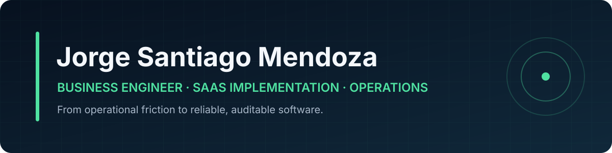

## I turn operational friction into reliable software

Business Engineer with experience across **Salesforce delivery, banking, telecommunications, Agile coordination and operational improvement**. I build practical systems with explicit workflows, testable business rules and documentation that survives handoffs.

`Peru` · `Open to remote and hybrid roles` · `English: working toward C1`

## Proof of work

| Project | Operational problem | Engineering evidence |
|---|---|---|
| **[SaaS Implementation Operations Lab](https://github.com/Jsantiagom11/saas-implementation-ops-lab)** | Fragmented customer onboarding, unclear delivery gates and weak accountability | FastAPI, Pydantic, SQLite, audit trail, governed transitions, strict typing and integration tests |
| **[Rumi Wawqi POS](https://github.com/Jsantiagom11/rumi-wawqi-pos)** | Weekend and event service without reliable connectivity or server infrastructure | Offline-first JavaScript, table lifecycle, kitchen dispatch, stock reservation, cash controls and regression tests |

These are deliberately different systems: one demonstrates **SaaS implementation governance**; the other demonstrates **real operational product ownership under infrastructure constraints**.

## Operating range

```text
Business problem → workflow model → control points → implementation → tests → operational feedback
```

| Delivery and domain | Engineering and tooling |
|---|---|
| SaaS/CRM implementation | Python 3.11+ · FastAPI · SQL |
| Agile delivery and stakeholder coordination | HTML · JavaScript · offline-first systems |
| Operations, service bottlenecks and controls | Git · pytest · mypy · Ruff · Node test runner |
| Troubleshooting and workflow automation | APIs · data pipelines · reproducible environments |

## What I optimize for

- **Operational truth:** software should reflect how work actually happens.
- **Traceability:** decisions, state changes and failures must be auditable.
- **Resilience:** systems should degrade safely when connectivity or infrastructure fails.
- **Economic value:** complexity must earn its maintenance cost.

## Current build direction

- Task-specific AI agents and workflow automation
- Quantitative finance, portfolio risk and decision systems
- Reliable offline tools for restaurant and field operations
- Production-grade packaging, observability and continuous integration

<sub>Every featured repository includes setup instructions, architecture decisions, tests and an explicit roadmap.</sub>

